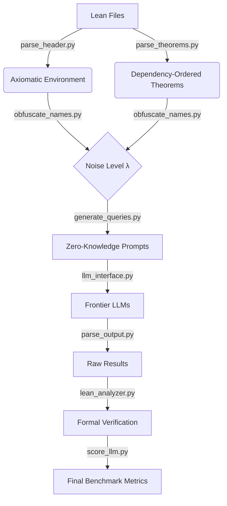

# Obfuscated-NNG Pipeline

## Project Overview

While Large Language Models have achieved significant success on formal mathematics benchmarks such as MiniF2F, it remains unclear whether these results stem from genuine logical reasoning or semantic pattern matching against pre-training data. This paper identifies Architectural Reasoning—the ability to synthesize formal proofs using exclusively local axioms and definitions within an alien math system—as the key ability for future automated theorem discovery AI. We use the Obfuscated Natural Number Game, a novel benchmark to evaluate Architectural Reasoning. By renaming identifiers in the Natural Number Game math system in Lean 4, we created a zero-knowledge, closed environment. We evaluate frontier models, finding a universal latency tax where obfuscation significantly increases inference time. The results also reveal a divergence in robustness: while general models (Claude-Sonnet-4.5, GPT-4o) suffer significant performance degradation, reasoning models (DeepSeek-R1, GPT-5, DeepSeek-Prover-V2) maintain the same accuracy despite the absence of semantic cues. These findings provide a rigorous metric for assessing the true capacity for mathematical reasoning.

## Pipeline Flow



## Directory Structure

```
.
├── parsing/              # Stage 1: Parse Lean theorem files
│   ├── parse_theorems.py       # Parse theorems from Lean files
│   └── parse_header.py         # Parse header definitions from Header.lean
│
├── obfuscation/          # Stage 2: Obfuscate theorem names
│   └── obfuscate_names.py      # Create obfuscated datasets with randomized names
│
├── queries/              # Stage 3: Generate LLM queries
│   └── generate_queries.py     # Create training queries from datasets
│
├── verification/         # Stage 4: Verify proofs in Lean
│   ├── jsonl_generator.py      # Generate Lean files from JSONL datasets
│   ├── code_normalize.py       # Normalize Lean code (indentation, syntax)
│   ├── lean_analyzer.py        # Analyze Lean files for errors, sorry, banned tactics
│   ├── verify_individual.py    # Verify individual result files
│   ├── record_time.py          # Record and analyze timing data
│   └── test_jsonl.py           # Test error detection with synthetic errors
│
├── benchmark/            # Stage 5: Benchmark LLMs
│   ├── llm_interface.py        # Unified interface for all LLMs (local + API)
│   ├── query_llm.py            # Run experiments on LLM models
│   ├── debug_llm.py            # Debug/test single theorem queries
│   └── patch_results.py        # Patch and analyze benchmark results
│
├── utils/                # Utilities
│   ├── parse_output.py         # Parse LLM outputs (JSON/Lean code)
│   └── discord_notify.py       # Discord webhook notifications
│
├── generate_dataset.py   # Main: Generate all datasets (original + obfuscated)
├── parallel_benchmark.py # Main: Run benchmarks
└── score_llm.py          # Main: Score and verify LLM results
```

## Quick Start

### 1. Generate Datasets

```bash
python3 generate_dataset.py
```

Creates:

- `dataset/original/` - Original dataset with queries
- `dataset/obfuscated_1/` through `dataset/obfuscated_5/` - Randomness levels 0.2, 0.4, 0.6, 0.8, 1.0

Each dataset contains:

- `header_definitions.jsonl` - 37 header definitions
- `theorems.jsonl` - 69 theorems
- `queries.jsonl` - 69 LLM training queries
- `name_mapping.json` - Name mapping (obfuscated only)

### 2. Run Benchmarks

```bash
export LLM_NAME="deepseek-r1"
export NUM_RUNS="5"
export START_RUN="1"
python3 parallel_benchmark.py
```

### 3. Score Results

```bash
export LLM_NAME="deepseek-r1"
python3 score_llm.py
```

## Pipeline Stages

### Stage 1: Parsing

**[parse_header.py](parsing/parse_header.py)** - Parses `Header.lean` to extract all definitions, axioms, and theorems. Creates `header_definitions.jsonl` with categories (inductive, axiom, def, theorem, etc.).

**[parse_theorems.py](parsing/parse_theorems.py)** - Parses Lean theorem files in dependency order and converts them into JSONL format. Extracts theorem statements, proofs, and known theorems from imports. Creates `theorems.jsonl`.

File dependency order: Addition → Implication → Algorithm → Multiplication → Power → AdvAddition → LessOrEqual → AdvMultiplication

### Stage 2: Obfuscation

**[obfuscate_names.py](obfuscation/obfuscate_names.py)** - Obfuscates theorem and definition names using character-level augmentation. Creates multiple obfuscated datasets with different randomness levels. Preserves proof correctness while making names unrecognizable.

| Set | Randomness | Character Replacement | Name Length Change  |
| --- | ---------- | --------------------- | ------------------- |
| 1   | 0.2        | ~20% of characters    | Small changes       |
| 2   | 0.4        | ~40% of characters    | Moderate changes    |
| 3   | 0.6        | ~60% of characters    | Significant changes |
| 4   | 0.8        | ~80% of characters    | Large changes       |
| 5   | 1.0        | All characters        | Maximum obfuscation |

Reserved names (Lean keywords, struct fields) are never obfuscated. Safe Unicode characters only.

### Stage 3: Query Generation

**[generate_queries.py](queries/generate_queries.py)** - Generates LLM training queries from datasets. Creates system prompts with header context and available theorems, plus user prompts for specific theorems. Outputs `queries.jsonl`.

Query format (each line is a JSON array):

```json
[
    {
        "role": "system",
        "content": "### ROLE AND CONTEXT\nYou are a highly specialized AI...\n### THE ALIEN SYSTEM DEFINITIONS (Context)\n...\n### Available theorems\n..."
    },
    {
        "role": "user",
        "content": "### THEOREM TO PROVE\ntheorem add_assoc (a b c : MyNat) : a + b + c = a + (b + c) := by\n\nProvide a detailed proof plan (draft) and the resulting Lean code (code) in the requested JSON format."
    }
]
```

### Stage 4: Verification

The verification system is organized into modular components:

**[jsonl_generator.py](verification/jsonl_generator.py)** - Generates Lean verification files from header and theorem JSONL files. Supports both theorems.jsonl and results_n.jsonl formats. Normalizes code before writing.

**[code_normalize.py](verification/code_normalize.py)** - Normalizes Lean code by fixing indentation, syntax, and stripping theorem declarations. Handles LLM-generated code from different Lean versions.

**[lean_analyzer.py](verification/lean_analyzer.py)** - Analyzes generated Lean files by running the Lean compiler. Iteratively identifies incorrect proofs, detects 'sorry' usage, and flags banned tactics. Returns detailed error reports with IDs and error messages.

**[verify_individual.py](verification/verify_individual.py)** - Simplified interface for verifying individual result files. Creates generated_proofs_n.jsonl from result_n.jsonl, runs verification, and returns statistics.

**[record_time.py](verification/record_time.py)** - Handles timing data: loading time_n.json files, computing statistics, and generating timing plots.

**[test_jsonl.py](verification/test_jsonl.py)** - Test suite for error detection. Creates synthetic error datasets with swapped proofs, sorry usage, and banned tactics to verify detection accuracy.

### Stage 5: Benchmarking

**[llm_interface.py](benchmark/llm_interface.py)** - Unified interface for all LLMs (local models like DeepSeek-Prover-V2, Goedel-Prover, and API models like GPT-4o, Gemini, DeepSeek-R1). Handles generation with retry logic and memory management.

**[query_llm.py](benchmark/query_llm.py)** - Experiment runner that queries LLMs on theorem datasets. Handles multiple runs, retry logic, and saves results incrementally. Supports progress callbacks.

**[debug_llm.py](benchmark/debug_llm.py)** - Simple test script to debug a single theorem query.

**[patch_results.py](benchmark/patch_results.py)** - Patch and analyze benchmark results.

### Stage 6: Scoring

**[score_llm.py](score_llm.py)** - Main scoring script that verifies all LLM results across datasets and runs. Uses the verification module to check proofs, aggregates timing data, computes statistics, and generates plots. Outputs statistics.json and avg_times.png for each dataset.

### Utilities

**[parse_output.py](utils/parse_output.py)** - Parses LLM outputs. Extracts JSON or Lean code from responses, handles malformed outputs, and validates schemas.

**[discord_notify.py](utils/discord_notify.py)** - Discord webhook notification system. Sends progress updates and crash reports during long-running jobs.

## Main Entry Points

### generate_dataset.py

Comprehensive dataset generation script. Creates obfuscated datasets with queries and updates the original dataset.

Functions:

- `create_dataset(set_number, randomness_level, show_progress=True)` - Creates complete dataset (obfuscation + queries)
- `update_original_with_queries()` - Generates queries for original dataset
- `generate_all_datasets()` - Generates 5 obfuscated datasets + 1 original

### parallel_benchmark.py

Parallel LLM benchmark runner. Main entry point for running benchmarks across multiple LLMs and datasets.

### score_llm.py

Main entry point for scoring and analyzing LLM results.

## Results Structure

Results are saved in `results/{llm_name}/{dataset_name}/`:

- `result_n.jsonl` - LLM outputs for run n
- `time_n.json` - Timing information for run n
- `generated_proofs_n.jsonl` - Verified proofs for run n
- `statistics.json` - Overall statistics
- `avg_times.png` - Plot of average solving times

## Dataset Statistics

- **Header definitions**: 37 entries
    - Inductive types: 1 (MyNat)
    - Constructors: 2 (zero, succ)
    - Axioms: 6 (add_zero, add_succ, mul_zero, mul_succ, pow_zero, pow_succ)
    - Definitions: 8
    - Instances: 6
    - Opaque: 3
    - Theorems: 11

- **Theorems**: 69 entries from 8 Lean files
    - Addition: 7 theorems
    - Implication: 10 theorems
    - Algorithm: 4 theorems
    - Multiplication: 9 theorems
    - Power: 9 theorems
    - AdvAddition: 6 theorems
    - LessOrEqual: 14 theorems
    - AdvMultiplication: 10 theorems

## System Requirements

- Python 3.7+
- tqdm library: `pip install tqdm`
- Lean 4 with lake (for verification)
- Required for benchmarking: API keys for OpenAI, Anthropic, Google (as needed)

## Error Handling

All functions raise appropriate exceptions:

- `FileNotFoundError` - Missing required files
- `RuntimeError` - Verification failures
- Other exceptions propagate with context

Command-line tools exit with appropriate codes:

- 0 = Success
- 1 = Error

## Notes

- Datasets are deterministic (same set_number = same output)
- Original dataset is automatically created on first obfuscation
- Verification uses sequential error detection (finds first error, fixes, repeats)
- Lean compilation timeout: 120 seconds
